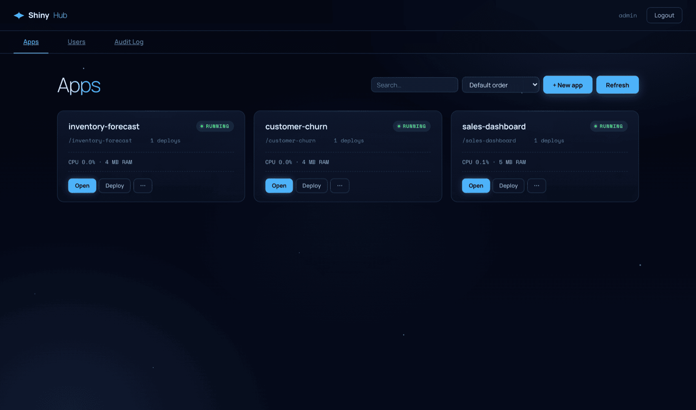

# ShinyHub

Self-hosted platform for deploying and managing [R Shiny](https://shiny.posit.co/)
apps. Deploy with a CLI, route traffic through a reverse proxy, log in with
OAuth or OIDC, and hibernate idle apps automatically.



## Features

- **Deploy from CLI:** `shiny deploy` uploads a bundle and brings the app up.
- **Reverse proxy:** one URL per app under `/app/<slug>/`.
- **Hibernation:** idle apps are stopped and restarted on demand.
- **Auth:** username/password, GitHub OAuth, Google OAuth, or generic OIDC
  (Okta, Azure AD, Keycloak, Auth0).
- **Access control:** public, private, or shared apps; member roles.
- **Per-app env vars & secrets:** encrypted at rest with AES-256-GCM.
- **Audit log:** 27 action types recorded for admin review.
- **Container isolation (optional):** run each app inside a Docker container
  with CPU and memory limits.
- **Per-app replicas:** set `replicas: N` and ShinyHub boots N backends for
  the app on the same host, sticky-session load-balanced and recovered
  independently on crash.
- **Single binary, SQLite, no external deps.**

## Quick start

### Docker (recommended)

```bash
mkdir -p ./shinyhub-data
cp shinyhub.yaml.example ./shinyhub.yaml
# Edit shinyhub.yaml: set auth.secret to the output of `openssl rand -hex 32`

docker run -d \
  --name shinyhub \
  -p 8080:8080 \
  -v "$PWD/shinyhub.yaml:/etc/shinyhub/shinyhub.yaml:ro" \
  -v "$PWD/shinyhub-data:/data" \
  -e SHINYHUB_ADMIN_USER=admin \
  -e SHINYHUB_ADMIN_PASSWORD=change-me \
  ghcr.io/rvben/shinyhub:latest
```

Open `http://localhost:8080`, log in with the admin credentials you set.

### Binary

```bash
curl -fsSL https://raw.githubusercontent.com/rvben/shinyhub/main/scripts/install.sh | sh
# Or download from https://github.com/rvben/shinyhub/releases

cp shinyhub.yaml.example shinyhub.yaml
# Set auth.secret to a 32-byte random value.

SHINYHUB_ADMIN_USER=admin SHINYHUB_ADMIN_PASSWORD=change-me \
  shinyhub --config ./shinyhub.yaml
```

### From source

```bash
git clone https://github.com/rvben/shinyhub.git
cd shinyhub
go build -o bin/shinyhub ./cmd/shinyhub
go build -o bin/shiny ./cmd/shiny
```

## Configuration

See [`shinyhub.yaml.example`](shinyhub.yaml.example) — every key is documented
inline. Environment variables (prefixed `SHINYHUB_`) override YAML; see the
example file for the full list.

Minimum required:

- `auth.secret` — random 32+ character string. Generate with
  `openssl rand -hex 32`. The server refuses to start with the placeholder
  value.

## Environment variables & secrets

Every app has its own key-value environment store. Non-secret values are
stored plaintext; values marked `--secret` are encrypted at rest with
AES-256-GCM (key derived from `SHINYHUB_AUTH_SECRET` via HKDF-SHA256) and
can never be read back through the API or UI.

### CLI

```
shiny env set demo AWS_REGION=eu-west-1
shiny env set demo AWS_SECRET_ACCESS_KEY --secret --stdin    # value from stdin
shiny env set demo LOG_LEVEL=debug --restart                 # restart the app after setting
shiny env ls  demo
shiny env rm  demo OLD_VAR
```

Keys must match `[A-Z_][A-Z0-9_]*`. Values are capped at 64 KiB each, with
at most 100 keys per app.

### UI

Open an app's **Settings** modal and switch to the **Environment** tab to
list, add, edit, and delete variables. Secret values are masked in the
list and write-only once created.

### Reserved prefix

Keys starting with `SHINYHUB_` are reserved for platform variables
(`SHINYHUB_APP_DATA`, future additions) and will be rejected with 422.

### Caveat: rotating `SHINYHUB_AUTH_SECRET`

The encryption key is derived from `SHINYHUB_AUTH_SECRET`. Rotating that
secret invalidates every stored secret; the affected apps will fail to
read their secret values until the variables are re-set via the CLI or
UI.

### When to use env vars vs persistent data

| You want to...                                         | Use                                  |
|--------------------------------------------------------|--------------------------------------|
| Configure a cloud bucket URL / DB URL / API endpoint   | Env var (non-secret)                 |
| Pass a password / API key / private key string        | Env var (secret)                     |
| Ship a Parquet / DuckDB / SQLite file the app reads   | *(coming soon — persistent data dir)* |
| Let the app write uploads / cache / session data      | *(coming soon — persistent data dir)* |

## Architecture


```
┌────────────┐    HTTPS    ┌──────────────────┐
│  Browser   │────────────▶│    ShinyHub      │
└────────────┘             │                  │
                           │  ┌────────────┐  │
┌────────────┐    CLI      │  │  API + UI  │  │
│  shiny     │────────────▶│  ├────────────┤  │
│  CLI       │             │  │   Proxy    │──┼──▶  app processes
└────────────┘             │  ├────────────┤  │     (native or Docker)
                           │  │   SQLite   │  │
                           │  └────────────┘  │
                           └──────────────────┘
```

Components:

- `cmd/shinyhub` — server (HTTP + proxy + lifecycle).
- `cmd/shiny` — developer CLI.
- `internal/api` — chi-routed HTTP handlers.
- `internal/process` — native or Docker app process lifecycle.
- `internal/proxy` — reverse proxy.
- `internal/db` — SQLite store.

## Status

v0.2.0 — first public release. Single-node, self-hosted. Used in production
by the maintainer. No SLA. Issues and PRs welcome.

## Links

- [Changelog](CHANGELOG.md)
- [Contributing](CONTRIBUTING.md)
- [License (MIT)](LICENSE)
- [Issues](https://github.com/rvben/shinyhub/issues)
