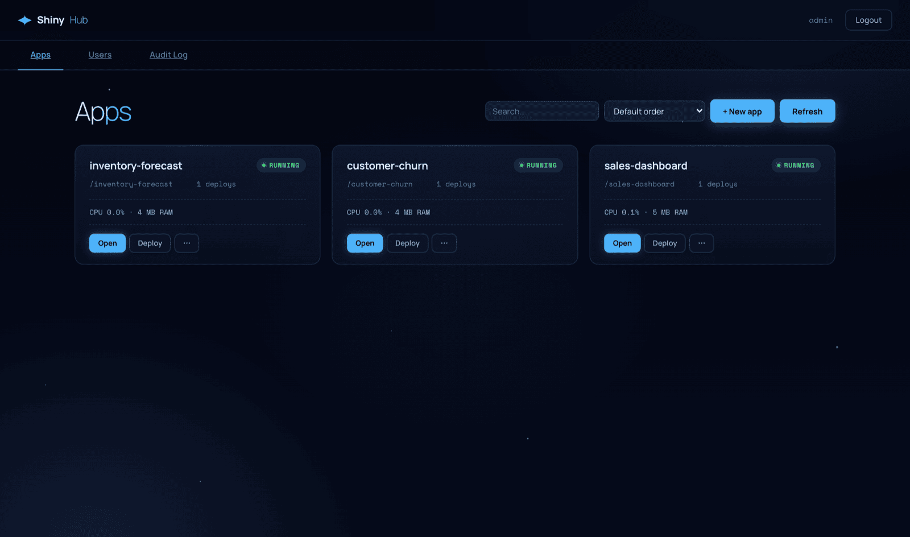

# ShinyHub

[](https://pypi.org/project/shinyhub/)
[](https://github.com/rvben/shinyhub/actions/workflows/ci.yml)
[](LICENSE)

Self-hosted platform for deploying and operating [R and Python Shiny](https://shiny.posit.co/)
applications. Push an app from the CLI, get a clean URL behind a built-in
reverse proxy, sign users in with OAuth or OIDC, and let idle apps hibernate
and wake on demand. ShinyHub runs as a single Go binary backed by SQLite, with
no external services to operate.

<p align="center">
  
</p>

## Contents

- [Features](#features)
- [Quick start](#quick-start)
- [Configuration](#configuration)
- [Guides](#guides)
- [Architecture](#architecture)
- [Status](#status)
- [Contributing](#contributing)
- [License](#license)

## Features

- **Deploy from the CLI.** `shinyhub deploy` uploads a bundle and brings the app up.
- **Several servers at once.** One saved credential per server, switched with `shinyhub use <name>` or targeted per command with `--host`. See [docs/hosts.md](docs/hosts.md).
- **Reverse proxy.** One URL per app under `/app/<slug>/`, sticky-session aware.
- **Hibernation.** Idle apps are stopped automatically and restarted on the next request.
- **Authentication.** Username/password, GitHub OAuth, Google OAuth, or generic OIDC (Okta, Azure AD, Keycloak, Auth0).
- **Access control.** Private (members only), shared (every signed-in user), or public apps, with per-app member and IdP-group roles.
- **Env vars and secrets.** Per-app key-value store; secrets encrypted at rest with AES-256-GCM. See [docs/environment.md](docs/environment.md).
- **Persistent data dir.** Each app gets a `data/` directory that survives deploys, with `shinyhub data push|ls|rm` and a UI tab. See [docs/data.md](docs/data.md).
- **Scheduled jobs and shared data.** Per-app cron schedules and read-only cross-app data mounts for fetcher to consumer pipelines. See [docs/schedules.md](docs/schedules.md).
- **Horizontal scaling.** Set `replicas: N` to run multiple load-balanced backends per app, recovered independently on crash. See [docs/scaling.md](docs/scaling.md).
- **Render pacing.** Set `render_seconds` to admit page loads at a rate the host can actually render, so a burst queues on a self-retrying wait page instead of stalling every session at once. See [docs/scaling.md](docs/scaling.md#render-pacing).
- **Fleet reconcile.** Declare a whole set of apps in one `fleet.toml` and converge the server to match, kubectl-apply style. See [docs/fleet.md](docs/fleet.md).
- **Observability.** OpenTelemetry tracing (proxy, app, and control-plane spans), an opt-in Prometheus `/metrics` endpoint, and a structured access log with request-ID and trace correlation. See [docs/tracing.md](docs/tracing.md) and [docs/metrics.md](docs/metrics.md).
- **Container isolation (optional).** Run each app inside a Docker container with CPU and memory limits.
- **Worker isolation.** Per-app session isolation dial: `multiplex` (shared event loop), `grouped` (N clients per worker), or `per_session` (one process per browser client, HOL-free). See [docs/isolation.md](docs/isolation.md).
- **Branding (white-label).** Customize the front door (title, logo, theme, landing page) without forking. See [docs/branding.md](docs/branding.md).
- **Audit log.** Mutating actions recorded for admin review.
- **Single binary, SQLite, no external dependencies.**

## Quick start

The simplest way to run ShinyHub end to end is with
[`uv`](https://docs.astral.sh/uv/): it installs and runs the server in one
command, and it is also the runtime ShinyHub uses to launch Python apps, so once
`uv` is on the host you have everything you need. For an isolated or production
deployment use [Docker](#docker); for a standalone server binary see
[Binary](#binary).

### uv (recommended)

```bash
uv tool install shinyhub

SHINYHUB_AUTH_SECRET="$(openssl rand -hex 32)" \
  SHINYHUB_ADMIN_USER=admin SHINYHUB_ADMIN_PASSWORD=change-me \
  shinyhub serve
```

`SHINYHUB_AUTH_SECRET` (a random 32+ character string) is the only required
setting; no YAML file is needed for a basic run. **Generate it once and reuse the
same value on every restart**: it signs sessions and derives the key that
encrypts app secrets, so changing it makes existing encrypted data unreadable.
Beyond a quick trial, load it from a file or secrets manager (or set `auth.secret`
in `shinyhub.yaml`). The database, bundles, and per-app data land under `./data/`
by default. Open `http://localhost:8080` and log in as `admin`.

Then deploy an app (an `app.py` + `requirements.txt`, or an `app.R` +
`renv.lock` - see [Deploy an R Shiny app](docs/recipes/r-shiny.md)) from
another terminal:

```bash
shinyhub login --host http://localhost:8080 --username admin
shinyhub deploy ./my-app --slug demo --wait   # live at /app/demo/
```

> Tip: run the bundle locally first with `shinyhub run ./my-app`. It keeps your
> source tree untouched, serves the production-shaped `/app/<slug>/` route, and
> swaps in edits only after they pass readiness. Add `--check` for a CI-friendly
> boot smoke test or `--fresh` to rebuild cached dependencies. See
> [Local development](docs/local-development.md).

> `uvx shinyhub <cmd>` runs any subcommand one-shot, without installing first.
> `pip install shinyhub` installs the server too, but native Python apps launch
> via `uv run`, so you still need `uv` on the host to deploy them.

### Docker

The published image runs the ShinyHub control plane, proxy, and dashboard, but it
is distroless and does **not** bundle a Python or R runtime, so it cannot run
apps on its own. To run apps under Docker, use the
[`deploy/docker-compose`](deploy/docker-compose) stack, which wires up the Docker
app runtime (each app in its own container) together with the host networking and
path-parity data root that runtime requires. To run apps without containers, run
the server on a host that has `uv` (the [uv path](#uv-recommended) above).

To start just the control plane (dashboard + API, not app execution) with a
persistent `/data` volume:

```bash
mkdir -p ./data
secret="$(openssl rand -hex 32)"   # generate once; reuse the SAME value on restart

docker run -d \
  --name shinyhub \
  -p 8080:8080 \
  -v "$PWD/data:/data" \
  -e SHINYHUB_AUTH_SECRET="$secret" \
  -e SHINYHUB_ADMIN_USER=admin \
  -e SHINYHUB_ADMIN_PASSWORD=change-me \
  ghcr.io/rvben/shinyhub:latest
```

The default `./data/...` paths resolve inside the mounted `/data` volume. Open
`http://localhost:8080` and log in with the admin credentials you set. To deploy
apps from here, switch to the [`deploy/docker-compose`](deploy/docker-compose)
stack; for storage and SSO settings, mount a `shinyhub.yaml`
(see [Configuration](#configuration)).

### Binary

For a host without Python, install the standalone server binary:

```bash
curl -fsSL https://raw.githubusercontent.com/rvben/shinyhub/main/scripts/install.sh | sh
# Or download from https://github.com/rvben/shinyhub/releases

SHINYHUB_AUTH_SECRET="$(openssl rand -hex 32)" \
  SHINYHUB_ADMIN_USER=admin SHINYHUB_ADMIN_PASSWORD=change-me \
  shinyhub serve
```

> The binary is the server only. Python apps are launched with `uv`, so install
> `uv` on the host too (or run apps under the Docker runtime).

### From source

```bash
git clone https://github.com/rvben/shinyhub.git
cd shinyhub
go build -o bin/shinyhub ./cmd/shinyhub
```

## Configuration

Every key is documented inline in
[`shinyhub.yaml.example`](shinyhub.yaml.example). Environment variables
(prefixed `SHINYHUB_`) override the YAML.

The server resolves its config file in this order: the `--config` flag
(`shinyhub serve --config /path/to/shinyhub.yaml`, also honored by `backup` and
`restore`), then the `SHINYHUB_CONFIG` environment variable, then
`./shinyhub.yaml`.

> **`SHINYHUB_CONFIG` has two distinct roles.** On the SERVER it selects the
> `shinyhub.yaml` config file. On CLIENT commands (`deploy`, `env`, `apps`, ...)
> it selects the credentials file (`~/.config/shinyhub/config.json` by default,
> written by `shinyhub login`). The `--config` flag on client commands likewise
> points to the credentials file, not the server YAML. For CI pipelines the
> simpler approach is to skip the credentials file entirely and supply
> `SHINYHUB_HOST` and `SHINYHUB_TOKEN` directly.

The credentials file holds one entry per server, so you can be signed in to a
local hub and production at the same time and switch with `shinyhub use`. See
[Working with several servers](docs/hosts.md) for how a command picks which
server and which token to use.

The one required setting is `auth.secret`: a random 32+ character string
(`openssl rand -hex 32`). The server refuses to start with the placeholder
value.

### CLI output

Client commands render a table on a terminal and JSON when their output is
piped or redirected, so `shinyhub apps list` is readable by a person and
parseable by a script without either having to ask. `-o table|json|ndjson`
forces one, `-q` suppresses non-essential prose, and `shinyhub schema`
describes every command, flag, and error kind as JSON.

Color and glyphs are decoration only: a status is always spelled out as a word
and a result always carries `✓` or `✗`, so nothing is lost when they are off.
They are off automatically whenever output is not a terminal, and can be
controlled explicitly:

| Setting | Effect |
|---|---|
| `--no-color` | No ANSI color. Wins over everything below. |
| `NO_COLOR=1` | No ANSI color ([no-color.org](https://no-color.org)). |
| `CLICOLOR=0` | No ANSI color. |
| `TERM=dumb` | No color, and no in-place redraw: the deploy progress line becomes one line per step. |
| `CLICOLOR_FORCE=1` | Color even when piped, for a CI log that renders ANSI. `FORCE_COLOR` is an alias. |
| `LANG=C` (any non-UTF-8 locale) | ASCII glyphs (`v`, `x`, `\|/-\`) instead of Unicode. |

## Guides

| Guide | Topic |
|---|---|
| [Working with several servers](docs/hosts.md) | Saving a credential per server, `hosts` / `use` / `--host`, which token a command sends, and the credentials file. |
| [Environment and secrets](docs/environment.md) | Per-app env vars, encrypted secrets, what apps and builds inherit from the server environment, and private package indexes. |
| [Persistent data dir](docs/data.md) | Pushing data, the app-visible path, authorization, quota, and concurrency. |
| [Scheduled jobs and shared data](docs/schedules.md) | Per-app cron schedules and read-only cross-app data mounts. |
| [Horizontal scaling](docs/scaling.md) | Per-app replicas, load balancing, and session admission. |
| [Worker isolation](docs/isolation.md) | Session isolation dial: multiplex, grouped, and per_session modes. |
| [App startup performance](docs/app-performance.md) | Why data lags the page shell, and the startup-scope and caching patterns that fix it. |
| [Fleet reconcile](docs/fleet.md) | Declaring and converging a whole set of apps from one file. |
| [Deploy manifest](docs/manifest.md) | The `shinyhub.toml` bundle manifest. |
| [Local development](docs/local-development.md) | Delightful control-plane and app-author workflows. |
| [Tracing](docs/tracing.md) | OpenTelemetry propagation, app spans, and control-plane spans. |
| [Metrics and logs](docs/metrics.md) | The `/metrics` endpoint, exposed series, and the structured access log. |
| [Branding](docs/branding.md) | White-label title, logo, theme, landing page, and footer links. |
| [Native OIDC login (SSO)](docs/native-oidc.md) | Terminate OpenID Connect SSO in ShinyHub itself - config, claim mapping, group-to-role, sessions/logout, behind-a-proxy, and HA - no external auth proxy. |
| [Identity forwarding to apps](docs/identity.md) | The trusted `X-Shinyhub-*` headers and signed token apps read to know the connected user, with one-call Python/R helpers. |
| [Reverse-proxy auth - Caddy](docs/reverse-proxy/caddy.md) | Authenticate users via Caddy `forward_auth` and forward the identity to ShinyHub. |
| [Reverse-proxy auth - nginx](docs/reverse-proxy/nginx.md) | Authenticate users via nginx `auth_request` and forward the identity to ShinyHub. |
| [CLI/CI behind an auth proxy](docs/reverse-proxy/deploying-behind-a-proxy.md) | Deploy and manage apps from the CLI or CI when ShinyHub is behind an auth proxy that blocks non-browser clients. |
| [OIDC bridge for LDAP/SAML](docs/reverse-proxy/oidc-bridge.md) | Wrap an LDAP or SAML source with an OIDC bridge (Authelia, Authentik, Keycloak) and use ShinyHub's built-in OIDC login. |

## Architecture

```text
┌────────────┐    HTTPS    ┌──────────────────┐
│  Browser   │────────────▶│    ShinyHub      │
└────────────┘             │                  │
                           │  ┌────────────┐  │
┌────────────┐    CLI      │  │  API + UI  │  │
│  shinyhub  │────────────▶│  ├────────────┤  │
│  deploy    │             │  │   Proxy    │──┼──▶  app processes
└────────────┘             │  ├────────────┤  │     (native or Docker)
                           │  │   SQLite   │  │
                           │  └────────────┘  │
                           └──────────────────┘
```

ShinyHub is one Go binary. `shinyhub serve` runs the HTTP API, the embedded
dashboard UI, the reverse proxy, and the lifecycle watchdog against a single
SQLite database; the same binary provides the developer subcommands (`deploy`,
`login`, `apps`, `env`, `data`, and more). App processes run natively or inside
Docker containers and are proxied per slug.

## Status

Active development. ShinyHub is self-hosted and run in production by the
maintainer, offered with no SLA or support guarantees. It runs single-node on
SQLite by default; an optional high-availability mode (multiple control-plane
instances behind a shared Postgres, with an ownership lease and off-host worker
tiers) is also supported - see
[docs/deployment/ha-data-plane.md](docs/deployment/ha-data-plane.md). See
[CHANGELOG.md](CHANGELOG.md) for the current release.

## Contributing

Issues and pull requests are welcome. See
[CONTRIBUTING.md](CONTRIBUTING.md) for development setup and conventions.

## License

[MIT](LICENSE)
