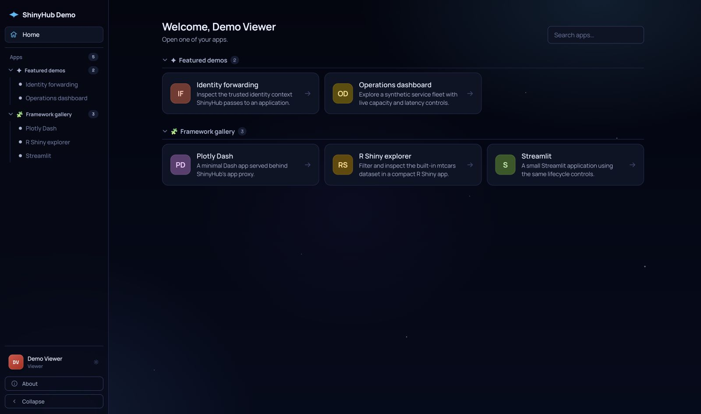

<section class="shiny-hero" markdown>

<div class="shiny-hero__copy" markdown>

<span class="shiny-status"><span aria-hidden="true"></span> Self-hosted · R and Python</span>

# Develop locally. Deploy with confidence.

ShinyHub gives authors of R Shiny, Python Shiny, Dash, and Streamlit apps one
safe development command, then deploys and operates the same applications with
built-in authentication, scaling, hibernation, and observability.

<div class="shiny-actions" markdown>

[Develop an app](local-development.md){ .shiny-button .shiny-button--primary }
[Try ShinyHub locally](getting-started/quickstart.md){ .shiny-button .shiny-button--secondary }

</div>

```bash
shinyhub dev .
```

Your directory chooses the scope. Add `--remote <host>` only when the app needs
that host. Source stays untouched, and only healthy edits reach the browser.

</div>

<figure class="shiny-hero__visual">
  <a href="https://demo.shinyhub.dev" aria-label="Open the live ShinyHub demo"></a>
  <figcaption><span aria-hidden="true"></span> Five live apps. One calm control plane.</figcaption>
</figure>

</section>

<div class="shiny-proof" role="list">
  <div role="listitem"><strong>One dev command</strong><span>Use the same loop for one app, a fleet, or a remote host.</span></div>
  <div role="listitem"><strong>Safe reloads</strong><span>Broken edits never replace the last healthy version.</span></div>
  <div role="listitem"><strong>Production path</strong><span>Develop through the same route and bundle model you deploy.</span></div>
</div>

## From source to a dependable URL

<div class="shiny-journey" markdown>

1. **Develop safely**

   `shinyhub dev .` runs the production-shaped route and swaps in an edit only after it becomes healthy.

2. **Preview the change**

   `shinyhub plan` shows the exact archive, manifest effects, permissions, and lifecycle changes without mutating the server.

3. **Deploy with progress**

   Follow dependency preparation, replica readiness, routing, and recovery through one stable CLI workflow.

4. **Operate by outcome**

   Keep viewer sessions responsive with hibernation, render pacing, worker isolation, metrics, and tracing.

</div>

```bash
shinyhub dev ./my-app  # edit safely; Ctrl-C when ready
shinyhub connect https://hub.example.com --name prod
shinyhub doctor ./my-app
shinyhub plan ./my-app
shinyhub deploy ./my-app --open
```

<section class="shiny-split" markdown>

<div markdown>

## Start small, keep the path forward

Use the same Go binary for a local evaluation, a single Docker host, or a PostgreSQL-backed multi-node deployment. Runtime tiers let one control plane place applications locally, on remote Docker workers, or on AWS Fargate.

[Choose an installation →](getting-started/installation.md)

</div>

<div class="shiny-terminal" aria-label="Example application manifest" markdown>

```toml
[app]
name = "Revenue forecast"
replicas = 2
max_sessions_per_replica = 10
render_seconds = 1.3
```

</div>

</section>

## Built for everyone in the delivery chain

Developers get one continuous path from the first local edit to a traced remote
deployment. Operators get explicit state, bounded resources, and recovery
paths. Viewers get the part that matters: a dashboard that opens quickly and
stays dependable.

<div class="shiny-final" markdown>

### See a real ShinyHub instance

The public demo runs curated applications on an isolated app origin. Open an app anonymously, or enter with one click for a read-only tour of the actual control plane.

[Open the demo guide](demo.md){ .shiny-button .shiny-button--primary }

</div>
